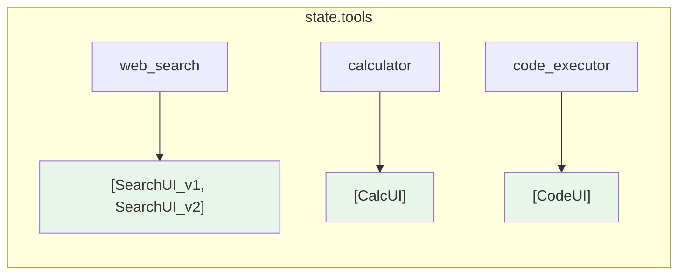
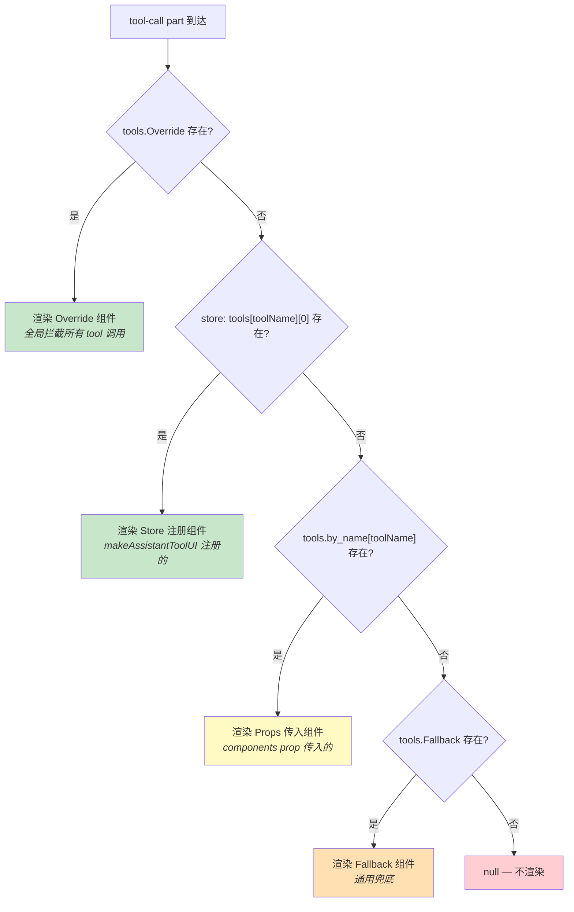
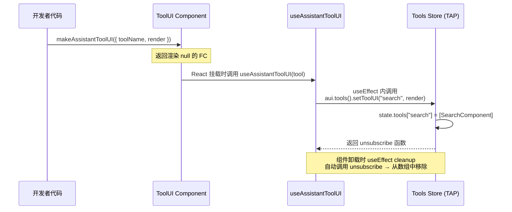
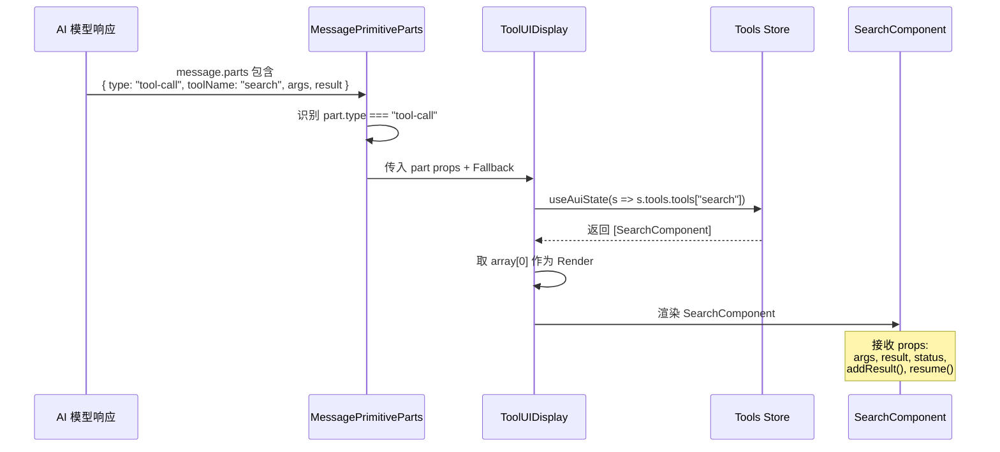

# assistant-ui 的 makeAssistantToolUI 原理与 Tool 注册机制深度解析

> 研究日期：2026-03-06
> 目标：理解 assistant-ui 如何实现 per-tool 级别的 UI 注册，为 agent-ui-sdk v0.2 的 `useToolUI` 设计提供参考

## 概述

assistant-ui 提供了一套精巧的 tool UI 注册机制，允许开发者为每个 AI tool 调用注册独立的自定义渲染组件。核心 API 是 `makeAssistantToolUI` 工厂函数和 `useAssistantToolUI` Hook。

## 核心文件

| 文件 | 职责 |
|------|------|
| `packages/core/src/react/model-context/makeAssistantToolUI.ts` | 工厂函数 |
| `packages/core/src/react/model-context/useAssistantToolUI.ts` | 注册 Hook |
| `packages/core/src/react/client/Tools.ts` | 注册存储（Registry Store） |
| `packages/core/src/react/primitives/message/MessageParts.tsx` | 渲染查找 |
| `packages/core/src/react/types/scopes/tools.ts` | 类型定义 |
| `packages/core/src/react/types/store-augmentation.ts` | Store 类型扩展 |

## 第一层：makeAssistantToolUI 工厂函数

```typescript
// packages/core/src/react/model-context/makeAssistantToolUI.ts

export type AssistantToolUI = FC & {
  unstable_tool: AssistantToolUIProps<any, any>;
};

export const makeAssistantToolUI = <TArgs, TResult>(
  tool: AssistantToolUIProps<TArgs, TResult>,
) => {
  const ToolUI: AssistantToolUI = () => {
    useAssistantToolUI(tool);
    return null;             // ← 关键：渲染 null
  };
  ToolUI.unstable_tool = tool;  // ← 元数据挂载
  return ToolUI;
};
```

**设计模式：隐形组件（Invisible Component）**

返回的组件是一个 **纯副作用组件**——它不渲染任何 UI（`return null`），存在于 React 树中的唯一目的是通过 `useAssistantToolUI` Hook 执行注册副作用。

这个模式的好处：
- **生命周期绑定**：组件挂载 = 注册，组件卸载 = 注销
- **声明式使用**：开发者只需将组件放入 JSX 树
- **条件注册**：可以通过条件渲染控制 tool UI 的注册/注销

```tsx
// 使用示例
const SearchToolUI = makeAssistantToolUI({
  toolName: "web_search",
  render: ({ args, result }) => <SearchResults query={args.query} results={result} />,
});

// 放入 React 树即完成注册
function App() {
  return (
    <AssistantProvider>
      <SearchToolUI />     {/* ← 渲染 null，但注册了 tool UI */}
      <Thread />
    </AssistantProvider>
  );
}
```

## 第二层：useAssistantToolUI 注册 Hook

```typescript
// packages/core/src/react/model-context/useAssistantToolUI.ts

export type AssistantToolUIProps<TArgs, TResult> = {
  toolName: string;
  render: ToolCallMessagePartComponent<TArgs, TResult>;
};

export const useAssistantToolUI = (
  tool: AssistantToolUIProps<any, any> | null,
) => {
  const aui = useAui();     // ← 获取全局 assistant client
  useEffect(() => {
    if (!tool?.toolName || !tool?.render) return undefined;
    return aui.tools().setToolUI(tool.toolName, tool.render);
    //     ↑ 注册，返回 unsubscribe 函数作为 cleanup
  }, [aui, tool?.toolName, tool?.render]);
};
```

**关键设计：**
- `useAui()` 获取全局 assistant client 实例（类似 Zustand 的 store accessor）
- `aui.tools()` 访问 tools scope（通过 TypeScript module augmentation 实现类型安全）
- `setToolUI()` 注册并返回 unsubscribe 函数
- `useEffect` 的 cleanup 自动执行 unsubscribe —— **零泄漏保证**

## 第三层：Tools Store（注册存储）

```typescript
// packages/core/src/react/client/Tools.ts（简化版）

export const Tools = resource(({ toolkit }) => {
  // 状态：toolName → 渲染组件数组
  const [state, setState] = tapState<ToolsState>(() => ({
    tools: {},   // Record<string, ToolCallMessagePartComponent[]>
  }));

  // 注册方法
  const setToolUI = tapCallback(
    (toolName: string, render: ToolCallMessagePartComponent) => {
      // 追加到数组
      setState((prev) => ({
        ...prev,
        tools: {
          ...prev.tools,
          [toolName]: [...(prev.tools[toolName] ?? []), render],
        },
      }));

      // 返回注销函数
      return () => {
        setState((prev) => ({
          ...prev,
          tools: {
            ...prev.tools,
            [toolName]: prev.tools[toolName]?.filter((r) => r !== render) ?? [],
          },
        }));
      };
    },
    [],
  );

  return {
    getState: () => state,
    setToolUI,
  };
});
```

**存储结构图：**



> 每个 toolName 映射到一个 FC **数组**，支持多个注册。

**为什么用数组而不是单个组件？**
- 支持"栈式注册"：多个组件可以为同一个 tool 注册 UI
- 渲染时取 `array[0]`，即最先注册的优先
- 允许插件/扩展系统叠加 tool UI

**toolkit 批量注册：**

Tools resource 还接收 `toolkit` prop，支持批量注册：

```typescript
tapEffect(() => {
  if (!toolkit) return;
  const unsubscribes = [];

  for (const [toolName, tool] of Object.entries(toolkit)) {
    if (tool.render) {
      unsubscribes.push(setToolUI(toolName, tool.render));
    }
  }

  // 同时注册 tool 定义到 model context
  const toolsWithoutRender = Object.entries(toolkit).reduce(
    (acc, [name, tool]) => {
      const { render, ...rest } = tool;
      acc[name] = rest;
      return acc;
    },
    {} as Record<string, Tool<any, any>>,
  );

  clientRef.current!.modelContext().register({
    getModelContext: () => ({ tools: toolsWithoutRender }),
  });

  return () => unsubscribes.forEach((fn) => fn());
}, [toolkit]);
```

这意味着 toolkit 不仅注册 UI，还将 tool schema 注册到 model context，让 AI 模型知道有哪些 tool 可用。

## 第四层：渲染管线（Rendering Pipeline）

```typescript
// packages/core/src/react/primitives/message/MessageParts.tsx（简化版）

const ToolUIDisplay = ({ Fallback, ...props }) => {
  // 从 store 查找注册的 tool UI
  const Render = useAuiState((s) => {
    const registered = s.tools.tools[props.toolName];
    if (Array.isArray(registered)) return registered[0] ?? Fallback;
    return registered ?? Fallback;
  });

  if (!Render) return null;
  return <Render {...props} />;
};

// 在 MessagePartComponent 中
if (type === "tool-call") {
  const addResult = aui.part().addToolResult;
  const resume = aui.part().resumeToolCall;

  // 三级查找
  if ("Override" in tools) return <tools.Override {...part} />;          // 1. 全局覆盖
  const Tool = tools.by_name?.[part.toolName] ?? tools.Fallback;       // 2. 按名查找 / fallback
  return <ToolUIDisplay Fallback={Tool} {...part} addResult={addResult} resume={resume} />;
  //                     ↑ 3. store 注册 > props 传入 > null
}
```

**三级 Fallback 查找链：**



## 完整数据流图

### 注册阶段



### 渲染阶段



## 真实使用示例

来自 `examples/with-langgraph/`：

```tsx
// 定义 Tool UI
export const PriceSnapshotTool = makeAssistantToolUI<
  PriceSnapshotToolArgs,
  string
>({
  toolName: "price_snapshot",
  render: function PriceSnapshotUI({ args, argsText, result }) {
    const resultObj = result
      ? (JSON.parse(result) as PriceSnapshotToolResult)
      : undefined;

    return (
      <div className="mb-4 flex flex-col items-center gap-2">
        <pre className="whitespace-pre-wrap">
          price_snapshot({argsText})
        </pre>
        {resultObj && (
          <PriceSnapshot ticker={args.ticker} {...resultObj.snapshot} />
        )}
      </div>
    );
  },
});

// 注册：放入 React 树
function App() {
  return (
    <AssistantRuntimeProvider runtime={runtime}>
      <PriceSnapshotTool />   {/* 隐形注册 */}
      <Thread />
    </AssistantRuntimeProvider>
  );
}
```

## 类型系统

### ToolCallMessagePartProps（渲染组件接收的 Props）

```typescript
export type ToolCallMessagePartProps<TArgs = any, TResult = unknown> =
  MessagePartState &
  ToolCallMessagePart<TArgs, TResult> & {
    addResult: (result: TResult | ToolResponse<TResult>) => void;
    resume: (payload: unknown) => void;
  };
```

- `args: TArgs` — tool 调用的输入参数（泛型，类型安全）
- `argsText: string` — 参数的原始文本
- `result: TResult` — tool 执行结果
- `status` — 执行状态
- `addResult()` — 允许 UI 手动写入结果（用于人工审批场景）
- `resume()` — 恢复挂起的 tool 调用

### Store 类型扩展

```typescript
// TypeScript module augmentation 实现全类型安全
declare module "@assistant-ui/store" {
  interface ScopeRegistry {
    tools: ToolsClientSchema;
    dataRenderers: DataRenderersClientSchema;
  }
}
```

## 并行机制：Data Renderers

assistant-ui 用完全相同的模式实现了 `makeAssistantDataUI` / `useAssistantDataUI`，用于自定义 data part 的渲染。这证明了该注册模式的通用性。

```typescript
// 同构的存储结构
export type DataRenderersState = {
  renderers: Record<string, DataMessagePartComponent[]>;
};
```

## 设计洞察

### 为什么这个设计很好

1. **声明式 API** — 放入 JSX 树即注册，移出即注销。开发者不需要手动管理生命周期。

2. **零泄漏** — useEffect cleanup 保证注销，不可能出现"忘了注销"的问题。

3. **组合性** — 多个 tool UI 可以独立注册，互不影响。可以用条件渲染动态控制。

4. **类型安全** — `makeAssistantToolUI<TArgs, TResult>` 的泛型贯穿到 render 函数的 props。

5. **多层 fallback** — Override → Store 注册 → Props 传入 → Fallback → null，灵活且可预测。

6. **插件友好** — 数组存储 + 自动清理 = 第三方插件可以安全地注册/注销 tool UI。

### 可能的不足

1. **数组取 [0]** — 多注册时只用第一个，其余被忽略。没有明确的优先级控制。

2. **无条件匹配** — 只能按 toolName 精确匹配，不支持 pattern/regex 匹配。

3. **render prop 无状态** — 每次渲染都是独立的，如果 tool UI 需要跨 tool-call 共享状态，需要额外方案。

## 对 agent-ui-sdk 的启示

| 维度 | assistant-ui | agent-ui-sdk 现状 | 建议方向 |
|------|-------------|-------------------|---------|
| 注册粒度 | per-tool | 全局 ToolPart 替换 | 引入 per-tool 注册 |
| API 形态 | `makeAssistantToolUI` + Hook | `components` prop | 两者并存 |
| 存储 | TAP resource（类 Zustand） | 无独立 store | 扩展 ChatContext 或用 Zustand |
| 类型安全 | 泛型 `<TArgs, TResult>` | `unknown` | 必须加泛型 |
| 多级 fallback | 三级 | 一级 | 至少两级 |

### 推荐的 agent-ui-sdk v0.2 API

```tsx
// 方案 A：Hook 式（轻量）
function MyChat() {
  useToolUI({
    toolName: "web_search",
    render: ({ args, result }) => <SearchResults {...args} results={result} />,
  });
  return <Chat />;
}

// 方案 B：工厂式（与 assistant-ui 对齐）
const SearchToolUI = makeToolUI<SearchArgs, SearchResult>({
  toolName: "web_search",
  render: ({ args, result, status }) => (
    <SearchCard query={args.query} results={result} loading={status === "running"} />
  ),
});

// 方案 C：Props 式（简单场景）
<Chat
  toolRenderers={{
    web_search: SearchComponent,
    calculator: CalculatorComponent,
  }}
  fallbackToolRenderer={DefaultToolRenderer}
/>
```

建议三种方式都支持，形成统一的 fallback 链：`toolRenderers prop` → `useToolUI 注册` → `components.ToolPart` → `DefaultToolPart`。
