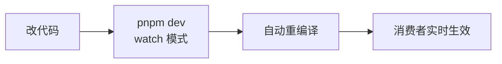
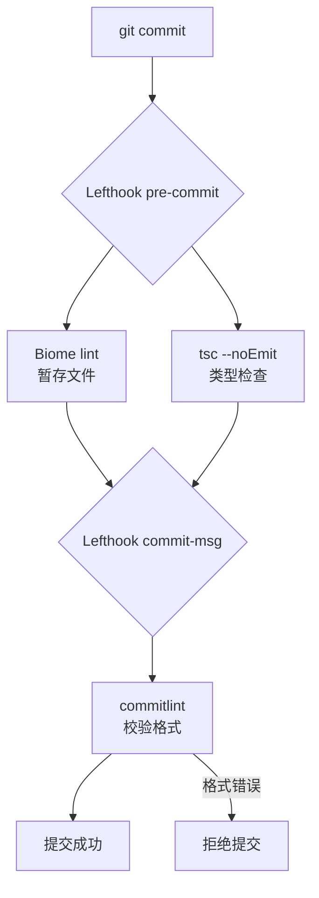
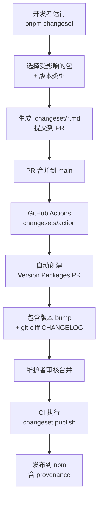
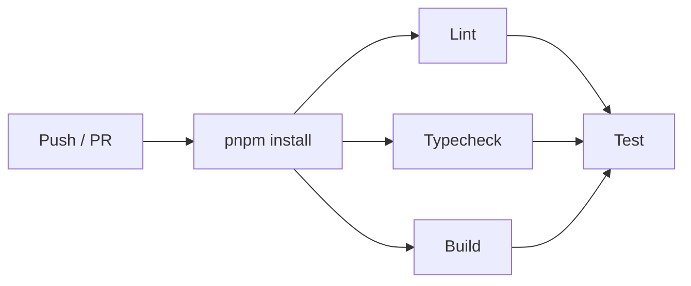
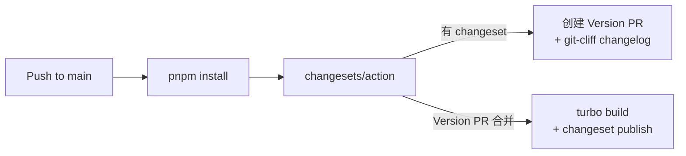

# Agent UI SDK — 工程化方案

> 调研日期：2026-03-04

## Monorepo 工具链

### 调研对比

| 工具 | 适用场景 | 优劣 |
|------|---------|------|
| **Turborepo** | 开源 JS/TS 库 | 最主流，缓存好，配置少 |
| Nx | 大型企业项目 | 功能全但重 |
| Moon | 多语言仓库 | 灵活但社区小 |
| Yarn Workspaces（裸用） | 小型库（如 reanimated） | 够用但无编排优化 |

**选择**：Turborepo + pnpm workspaces

### 构建工具

| 工具 | 引擎 | 状态 |
|------|------|------|
| **tsdown** | Rolldown（Rust） | 新项目推荐，比 tsup 快 49% |
| tsup | esbuild + Rollup | 成熟但 2025 后维护减少 |
| unbuild | Rollup | UnJS 生态 |
| assistant-ui 自研 `aui-build` | TypeScript Compiler API | 完全掌控但开发成本高 |

**选择**：tsdown（ESM + CJS 双输出 + DTS + sourcemap）

### 版本管理

| 工具 | 设计理念 | 适合 |
|------|---------|------|
| **Changesets** | 手动声明变更意图（.changeset 文件） | 多包 monorepo |
| semantic-release | 从 commit message 自动推导版本 | 单包仓库 |

**选择**：Changesets（版本 + 发布）+ git-cliff（changelog 生成）

### 分工
- **Changesets**：管版本 bump + npm publish + GitHub Release PR
- **git-cliff**：从 conventional commits 生成 CHANGELOG.md（替代 Changesets 的默认 changelog）
- Changesets 配置 `"changelog": false` 关闭其默认 changelog

### Git Hooks

| 工具 | 组成 | 特点 |
|------|------|------|
| **Lefthook** | 单个 Go 二进制 | 一个 yml 配置，原生并行，内置 glob + staged_files |
| Husky + lint-staged | 两个 npm 包 | 需要两个配置，启动有 Node.js 开销 |

**选择**：Lefthook + commitlint（conventional commits 强制）

### 代码检查

| 工具 | 速度 | 限制 |
|------|------|------|
| **Biome 2** | 10-25x 快于 ESLint | 缺少 `eslint-plugin-react-native` |
| ESLint + Prettier | 生态完整 | 慢，配置多 |

**选择**：Biome 2（web + 共享包）。RN 包若需要 RN 特有 lint 规则，后续补充 ESLint。

### 测试

| 平台 | 工具 | 理由 |
|------|------|------|
| Web / 共享 | **Vitest** | 原生 ESM/TS，10-20x 快于 Jest |
| React Native | **Jest** (jest-expo) | RN 必须用 Jest，Metro transform 依赖 |

### RN 兼容注意

- `.npmrc` 设 `node-linker=hoisted`（pnpm 隔离模式会破坏 Metro）
- Metro 需启用 `unstable_enablePackageExports: true`（支持 package.json exports）
- 确保整个 monorepo 只有一个 React Native 版本

## 开发工作流

### 日常开发



### 提交流程



合法的提交格式：
- `feat: add smooth streaming animation`
- `fix: branch navigation off-by-one error`
- `docs: update README with usage examples`

常用 type：`feat` / `fix` / `docs` / `refactor` / `perf` / `test` / `chore` / `ci`

### 发版流程



## CI/CD 配置

### CI (ci.yml)



### Release (release.yml)



## 与 edgemind-web 的开发集成

采用 **pnpm workspace link** 方案（非 git submodule）：

```mermaid
flowchart TB
  subgraph edgemind-web
    A[package.json\n@agent-ui-sdk/core: workspace:*]
    B[pnpm-workspace.yaml\n../agent-ui-sdk/packages/*]
  end
  subgraph agent-ui-sdk
    C[packages/core]
    D[packages/react]
  end
  B -.-> C & D
  A --> C & D
```

- 开发时：`workspace:*` 自动 link 到本地源码
- 发布后：改成 `"^0.1.0"` 等正式版本号，删除 `pnpm-workspace.yaml`
