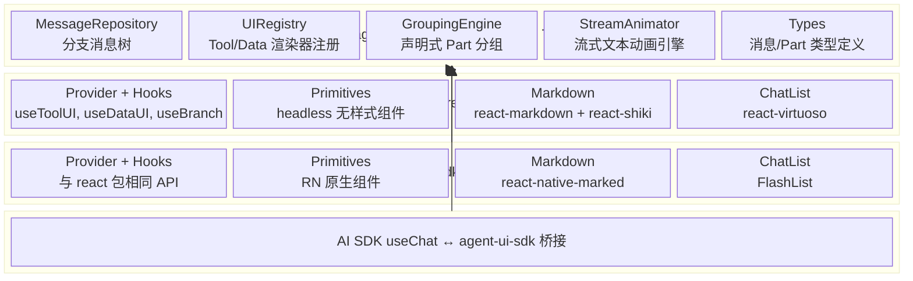
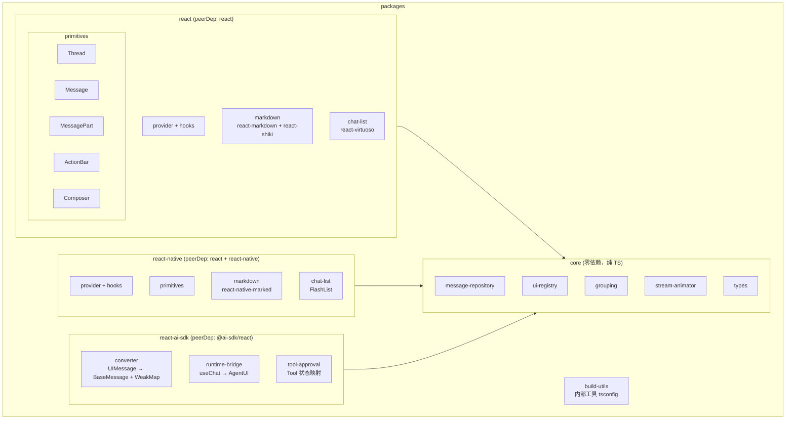

# Agent UI SDK — 技术栈规划

> 调研日期：2026-03-04
> 参考项目：[assistant-ui](https://github.com/assistant-ui/assistant-ui)、edgemind

## 架构总览



## 设计理念：Headless First

| 决策 | 选择 | 理由 |
|------|------|------|
| 组件风格 | **Headless/无样式** | 库不应绑定具体 UI 框架，消费者自带 Tailwind/NativeWind |
| API 模式 | **Hooks + 无样式 Primitives** | 参考 Radix UI / assistant-ui 的 Primitive 模式 |
| 可选样式包 | 后续提供 `@agent-ui-sdk/theme-default` | 预置 Tailwind + NativeWind 主题 |

核心原则：**逻辑层（hooks）和渲染层（primitives）分离**，消费者可以只用 hooks 自己画 UI，也可以用 primitives 快速搭建。

## 各关注点技术选型

### 1. Markdown 渲染 + 代码高亮（统一方案）

| 平台 | 库 | 版本 | 说明 |
|------|---|------|------|
| Web | `streamdown` | ^2.3 | Vercel 官方 AI streaming markdown 渲染器，替代 react-markdown |
| Web 代码高亮 | `@streamdown/code` | ^1 | 基于 Shiki，VS Code 级别高亮，内置 copy/download 按钮 |
| Web 数学公式 | `@streamdown/math` | ^1 | 基于 KaTeX（可选） |
| Web 图表 | `@streamdown/mermaid` | ^1 | Mermaid 图表，支持全屏/缩放（可选） |
| Web CJK | `@streamdown/cjk` | ^1 | 中日韩标点优化（可选） |
| RN | `react-native-marked` | ^8 | 基于 marked.js，提供 `useMarkdown` hook，FlatList 友好 |
| RN 代码高亮 | `react-native-code-highlighter` | ^2 | 基于 highlight.js |

**为什么选 streamdown 而非 react-markdown**：
- **`remend` 引擎**：自动修复流式中的不完整 markdown（未关闭的 `**`、`[link(`、` ``` ` 等），react-markdown 需要自己处理
- **`isAnimating` prop**：内置流式光标动画，无需自己实现 rAF 逻辑
- **Vercel 生态一致性**：AI SDK `useChat` + streamdown 是官方推荐组合，`vercel/ai-chatbot` 模板直接使用
- **插件化**：代码高亮、数学公式、mermaid 图表各自独立包，按需引入
- **API 兼容**：`components` / `allowedElements` / `urlTransform` 与 react-markdown 完全一致（drop-in 替换）
- **活跃度**：v2.3.0，4,601 stars，~190K 日下载量，今天还在更新

**注意**：streamdown 依赖 Tailwind CSS，因此 `@agent-ui-sdk/react` 包要求消费者项目使用 Tailwind。这对 Web/H5 项目是合理假设。

**跨平台策略**：core 包不做 markdown 渲染。react 用 streamdown，react-native 用 react-native-marked，各自封装 `<MarkdownRenderer>` primitive，API 一致（接受 `content: string` + `isStreaming: boolean`）。

**RN 备选/关注**：
- `@docren/react-native-markdown` — 基于 MDAST（与 streamdown 同源 AST 体系），类型安全。较新，值得评估。

### 2. 流式文本动画

**Web 端**：streamdown 已内置流式动画支持（`isAnimating` prop + CSS 光标动画），Web 端不需要额外实现。

**RN 端**：需要自行实现。参考 assistant-ui 的 `TextStreamAnimator`，核心算法放在 **core 包**（纯 TS）：

```ts
// 自适应速度算法
baseTimePerChar = Math.min(5ms, 250ms / remainingChars)
// 远落后时快速追赶，接近时平滑显示
```

| 平台 | 调度机制 | 说明 |
|------|---------|------|
| Web | streamdown `isAnimating` prop | 内置，无需额外代码 |
| RN | `setInterval(16ms)` 或 Reanimated worklet | core 的 `StreamAnimator` + RN 调度注入 |

**core 设计**：`StreamAnimator` class 接受 `setText` + `scheduleFrame` 回调（平台注入）。RN 提供 `useSmooth(text, isStreaming)` hook。Web 端可选用（如果不想依赖 streamdown 的内置动画）。

### 4. 虚拟化列表

| 平台 | 库 | 版本 | 说明 |
|------|---|------|------|
| Web | `react-virtuoso` | ^4 | 内置 `VirtuosoMessageList`，专为 chat 设计 |
| RN | `@shopify/flash-list` | ^2 | 2025 重写版，cell 回收，自动保持滚动位置 |

关键 chat 特性：
- 倒序滚动（最新消息在底部）
- 新消息自动滚到底
- 加载历史时保持位置（不跳动）
- 动态高度（每条消息高度不同）

**跨平台策略**：抽象 `<ChatList>` 组件，统一 props API（messages, onLoadMore, onScrollToBottom），`.web.tsx` 用 virtuoso，`.native.tsx` 用 FlashList。

### 5. 手势交互

| 平台 | 库 | 版本 | 用途 |
|------|---|------|------|
| RN | `react-native-gesture-handler` | ^2 | 滑动回复、长按菜单（UI 线程手势识别） |
| RN | `react-native-reanimated` | ^3 | 手势响应动画（UI 线程 worklet） |
| Web | `@use-gesture/react` | ^10 | 拖拽、滑动 |
| Web | `motion` | ^11 | 动画 + 简单手势 |

Chat 手势场景：
- **滑动回复**（Telegram 风格）：RNGH `Swipeable` / Web `useDrag` axis lock
- **长按菜单**：RNGH `Gesture.LongPress()` / Web pointerdown timer
- **双击 emoji 反应**：RNGH `Gesture.Tap().numberOfTaps(2)` + `Gesture.Race`

### 6. 样式方案

| 关注点 | 方案 |
|--------|------|
| 库本身 | **零样式**，只输出 headless 组件 + `data-*` 属性 |
| data 属性 | `data-status="running"` / `data-role="assistant"` — 纯 CSS 做状态样式 |
| CSS hook | 每个组件加 `aui-*` class name，消费者不需要 Tailwind 也能用 CSS 覆盖 |
| 可选主题包 | Tailwind（web）+ NativeWind（RN），共享 `tailwind.config.js` |

**NativeWind v4** 允许在 RN 中使用 Tailwind className，与 web 共享同一份 tailwind config。限制：复杂选择器（`group-hover:`、`[data-*]:`）在 native 端不可用。

### 7. AI SDK 适配层

单独可选包 `@agent-ui-sdk/react-ai-sdk`：

| 功能 | 实现 |
|------|------|
| `useChat` → `MessageRepository` 同步 | WeakMap 缓存转换（参考 `ThreadMessageConverter`） |
| 状态映射 | AI SDK status → `isRunning` / `isStreaming` |
| Tool result 桥接 | `addToolResult` → AI SDK `addToolOutput` |
| Data part 转换 | `data-xxx` → `{ type: "data", name: "xxx" }` |
| 分支操作 | Edit → AI SDK `setMessages` 截断 + 重发 |
| 流式参数稳定化 | `stableStringifyToolArgs` — WeakMap 缓存 key 顺序，避免 streaming 时 JSON key 乱序触发重渲染 |

## 包结构



## assistant-ui 模式取舍

### 采用的模式

| 模式 | 采用方式 |
|------|---------|
| **MessageRepository 分支树** | 已在 core 实现，链表树结构 |
| **UIRegistry 注册制** | 已在 core 实现，栈式注册/卸载 |
| **WeakMap 消息转换缓存** | 放在 react-ai-sdk 适配层 |
| **StreamAnimator 自适应动画** | 算法放 core（纯 TS），平台调度各自注入 |
| **Headless Primitives** | 参考但简化，不做 Radix 级别的 Primitive 体系 |
| **`data-status` CSS 状态属性** | 所有 primitive 输出 data 属性，支持纯 CSS 样式化 |
| **memoized markdown 组件** | 避免 streaming 时整个 markdown 树重渲染 |
| **Smooth status provider** | 独立跟踪动画状态（vs 服务端流式状态），用于 CSS 打字指示器 |

### 不采用的模式

| 模式 | 不采用原因 |
|------|-----------|
| **Tap 响应式系统** | 过重。在 React 之外重建 fiber 系统，用 Zustand + `useSyncExternalStore` 即可替代 |
| **ScopeRegistry 类型增强** | Module augmentation 面向插件生态的 DX，初期不需要 |
| **ResourceFiber** | 自建 fiber + hooks 系统（tapState/tapEffect/tapMemo）复杂度太高 |
| **AssistantClient Proxy** | Zustand selector 已解决同样的懒取值问题 |
| **CSS-in-JS** | headless 库不应绑定样式方案 |

## 工程化技术栈

| 关注点 | 选择 | 版本 |
|--------|------|------|
| 包管理器 | pnpm workspaces | 10 |
| 构建编排 | Turborepo | 2 |
| 构建工具 | tsdown（基于 Rolldown） | 0.12 |
| 模块格式 | ESM + CJS 双输出 | — |
| 代码检查 | Biome | 2 |
| 测试 (web/shared) | Vitest | 3 |
| 测试 (RN) | Jest (jest-expo) | — |
| Git hooks | Lefthook | 1 |
| Commit 规范 | commitlint + conventional commits | — |
| 版本管理 | Changesets | 2 |
| Changelog | git-cliff（替代 Changesets 默认 changelog） | — |
| CI/CD | GitHub Actions | — |
| npm 发布 | changesets/action + provenance | — |

## 依赖汇总

### core（零依赖）
无外部依赖，纯 TypeScript。

### react
| 依赖 | 类型 | 用途 |
|------|------|------|
| `react` | peer | React 18/19 |
| `react-dom` | peer | DOM 渲染 |
| `streamdown` | dep | AI streaming markdown 渲染（Vercel 官方） |
| `@streamdown/code` | dep | Shiki 代码高亮 |
| `@streamdown/math` | optional dep | KaTeX 数学公式 |
| `@streamdown/mermaid` | optional dep | Mermaid 图表 |
| `@streamdown/cjk` | optional dep | CJK 标点优化 |
| `react-virtuoso` | dep | 虚拟化聊天列表 |
| `@use-gesture/react` | optional dep | 手势（滑动回复等） |

### react-native
| 依赖 | 类型 | 用途 |
|------|------|------|
| `react` | peer | React 18/19 |
| `react-native` | peer | RN 运行时 |
| `react-native-marked` | dep | Markdown 渲染 |
| `react-native-code-highlighter` | dep | 代码高亮 |
| `@shopify/flash-list` | peer | 虚拟化列表 |
| `react-native-gesture-handler` | peer | 手势 |
| `react-native-reanimated` | peer | 动画 |

### react-ai-sdk
| 依赖 | 类型 | 用途 |
|------|------|------|
| `@ai-sdk/react` | peer | AI SDK useChat |
| `@agent-ui-sdk/core` | dep | 核心类型和工具 |
